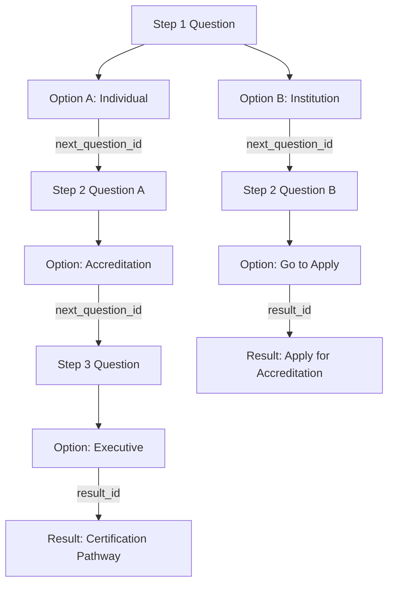

# Pathway Wizard Module: Backend and API Documentation

এই ডকুমেন্টে উইজার্ডের ডেটাবেজ লজিক, মডেল রিলেশনশিপ, API এণ্ডপয়েন্ট এবং ফ্রন্টএন্ডে এটি কিভাবে ইন্টিগ্রেট করবেন তা প্র্যাক্টিক্যাল এক্সাম্পলসহ বিস্তারিত ব্যাখ্যা করা হয়েছে।

---

## ১. ডেটাবেজ আর্কিটেকচার (Database Schema)

আমরা একটি **Decision Tree (ডাইনামিক পাথ)** আর্কিটেকচার ব্যবহার করেছি। এর মানে হচ্ছে যেকোনো অপশন সিলেক্ট করার পর কাস্টমারকে পরবর্তী কোন প্রশ্ন বা রেজাল্ট দেখানো হবে, তা ডেটাবেজের রিলেশন দিয়ে নির্ধারিত হয়।



### ডাটাবেজ টেবিলসমূহ:
1. **`pathway_questions`**: প্রশ্নগুলো স্টোর করে (যেমন: `question_text`, `step_number`).
2. **`pathway_options`**: প্রতিটি প্রশ্নের অপশনগুলো স্টোর করে। এখানে দুটি গুরুত্বপূর্ণ ফরেন কী (Foreign Key) আছে:
   - `next_question_id` (যদি অপশনটি পরবর্তী কোশ্চেনে রিডাইরেক্ট করে).
   - `result_id` (যদি অপশনটি সরাসরি রেজাল্ট শো করে).
3. **`pathway_results`**: ফাইনাল রেজাল্ট কার্ডের টেক্সট, ইনফো বক্স, ব্যাজ এবং বাটনের লিংক ও নাম স্টোর করে।

---

## ২. মডেল ও রিলেশনশিপ (Eloquent Models)

### ক) PathwayQuestion Model
[PathwayQuestion](file:///c:/Users/farha/Herd/ramzi113/app/Models/PathwayQuestion.php) প্রতিটি প্রশ্নের সাথে তার অপশনগুলোকে কানেক্ট করে।
```php
class PathwayQuestion extends Model
{
    public function options()
    {
        return $this->hasMany(PathwayOption::class, 'question_id')->orderBy('order', 'asc');
    }
}
```

### খ) PathwayOption Model
[PathwayOption](file:///c:/Users/farha/Herd/ramzi113/app/Models/PathwayOption.php) অপশনটি থেকে পরবর্তী ডাইনামিক গন্তব্য (Next Question অথবা Result) নির্ধারণ করে।
```php
class PathwayOption extends Model
{
    public function nextQuestion()
    {
        return $this->belongsTo(PathwayQuestion::class, 'next_question_id');
    }

    public function result()
    {
        return $this->belongsTo(PathwayResult::class, 'result_id');
    }
}
```

---

## ৩. এপিআই এণ্ডপয়েন্ট ও লাইভ এক্সাম্পল (API Endpoints & Examples)

আমরা এই উইজার্ডের জন্য দুটি এপিআই এণ্ডপয়েন্ট তৈরি করেছি:
1. `GET /api/pathways/start` (উইজার্ড শুরু করার জন্য)
2. `GET /api/pathways/step/{option_id}` (পরবর্তী প্রশ্নের ধাপ বা রেজাল্ট লোড করার জন্য)

### এক্সাম্পল ফ্লো:

#### ধাপ ১: উইজার্ড লোড করা
ফ্রন্টএন্ড লোড হওয়ার সাথে সাথে রিকোয়েস্ট পাঠান:
* **URL:** `http://127.0.0.1:8000/api/pathways/start`
* **Response:**
```json
{
  "success": true,
  "type": "question",
  "data": {
    "id": 1,
    "step_number": 1,
    "question_text": "Which best reflects your role or organisation?",
    "options": [
      { "id": 1, "option_text": "Individual professional", "next_question_id": 2, "result_id": null },
      { "id": 2, "option_text": "Training provider, university, or institution", "next_question_id": 3, "result_id": null },
      { "id": 3, "option_text": "Organisation seeking advisory or capability-building support", "next_question_id": 3, "result_id": null }
    ]
  }
}
```

#### ধাপ ২: ইউজার অপশন ২ ("Training provider...") সিলেক্ট করল
কাস্টমার যখন দ্বিতীয় অপশনটি সিলেক্ট করবে, ফ্রন্টএন্ড থেকে এপিআই কল হবে সিলেক্ট করা অপশনটির আইডি (`id: 2`) নিয়ে:
* **URL:** `http://127.0.0.1:8000/api/pathways/step/2`
* **Response:** (এটি Step 2 এর জন্য নির্দিষ্ট কোশ্চেন এবং তার অপশন নিয়ে আসবে)
```json
{
  "success": true,
  "type": "question",
  "data": {
    "id": 3,
    "step_number": 2,
    "question_text": "How would you like to proceed?",
    "options": [
      { "id": 8, "option_text": "View accreditation overview", "next_question_id": null, "result_id": 2 },
      { "id": 9, "option_text": "Go directly to apply for accreditation", "next_question_id": null, "result_id": 1 }
    ]
  }
}
```

#### ধাপ ৩: ইউজার অপশন ৯ ("Go directly to apply...") সিলেক্ট করল
ইউজার এবার অপশন আইডি `9` সিলেক্ট করল। ফ্রন্টএন্ড আবার এপিআই কল পাঠাবে:
* **URL:** `http://127.0.0.1:8000/api/pathways/step/9`
* **Response:** (যেহেতু এই অপশনটির সাথে সরাসরি রেজাল্ট ম্যাপ করা আছে, এপিআই টাইপ `result` এবং রেজাল্ট কার্ডের সমস্ত ডেটা প্রদান করবে)
```json
{
  "success": true,
  "type": "result",
  "data": {
    "id": 1,
    "title": "Apply for GIHQS Accreditation",
    "description": "Proceed directly to the GIHQS accreditation application route for recognised education, training, or certification offerings.",
    "badges": ["Apply", "Accreditation", "Institutional"],
    "info_box_text": "This route is appropriate when your need is clear and you are ready to move from exploration to formal application.",
    "primary_button_text": "Apply for Accreditation",
    "primary_button_url": "/accreditation/apply",
    "secondary_button_text": "View Accreditation",
    "secondary_button_url": "/accreditation/overview"
  }
}
```

---

## ৪. ফ্রন্টএন্ড জেকোয়েরি/এজ্যাক্স ইমপ্লিমেন্টেশন কোড (Frontend Integration Sample)

নিচের জাভাস্ক্রিপ্ট কোডটি আপনার ফ্রন্টএন্ড এইচটিএমএল ফাইলে যুক্ত করে কাস্টমার পেজে ৩-স্টেপের ডাইনামিক কোয়েশ্চেন লোড করতে পারবেন:

```html
<!-- HTML Structure -->
<div id="pathway-wizard-container" style="background-color: #1a3c34; color: white; padding: 40px; border-radius: 8px;">
    <div id="wizard-loading" class="text-center">Loading pathway...</div>
    <div id="wizard-content" class="d-none">
        <h6 id="wizard-step-label" style="color: #c9b067; letter-spacing: 1px;"></h6>
        <h2 id="wizard-question-text" class="my-3"></h2>
        <div id="wizard-options-container" class="d-flex flex-column gap-2 mt-4">
            <!-- Buttons will render here -->
        </div>
    </div>
    
    <!-- Result Card -->
    <div id="wizard-result" class="d-none" style="background: white; color: #333; padding: 30px; border-radius: 8px;">
        <span class="text-muted text-uppercase fs-12">Recommended Route</span>
        <h3 id="result-title" class="my-2 text-success"></h3>
        <p id="result-description" class="text-muted"></p>
        
        <div id="result-badges" class="my-3 d-flex gap-2"></div>
        
        <div id="result-infobox" class="p-3 my-3" style="border: 1px solid #c9b067; background-color: #fdfaf2; border-radius: 4px;"></div>
        
        <div class="d-flex gap-3 mt-4">
            <a id="result-primary-btn" href="#" class="btn btn-success"></a>
            <a id="result-secondary-btn" href="#" class="btn btn-outline-secondary"></a>
        </div>
        <button id="start-over-btn" class="btn btn-link mt-3 text-success p-0 d-block">Start Over</button>
    </div>
</div>

<!-- JavaScript Integration -->
<script src="https://code.jquery.com/jquery-3.7.0.min.js"></script>
<script>
    $(document).ready(function() {
        // উইজার্ড প্রথম শুরু করা
        function startWizard() {
            $('#wizard-result').addClass('d-none');
            $('#wizard-content').addClass('d-none');
            $('#wizard-loading').removeClass('d-none');
            
            $.ajax({
                url: '/api/pathways/start',
                type: 'GET',
                success: function(response) {
                    $('#wizard-loading').addClass('d-none');
                    if (response.success && response.type === 'question') {
                        renderQuestion(response.data);
                    }
                }
            });
        }

        // কোশ্চেন স্ক্রিনে রেন্ডার করা
        function renderQuestion(question) {
            $('#wizard-step-label').text('STEP ' + question.step_number + ' OF 3');
            $('#wizard-question-text').text(question.question_text);
            
            let optionsHtml = '';
            question.options.forEach(function(option) {
                optionsHtml += `<button class="btn btn-outline-light text-start p-3 w-100 option-select-btn" data-id="${option.id}">
                                    ${option.option_text}
                                </button>`;
            });
            
            $('#wizard-options-container').html(optionsHtml);
            $('#wizard-content').removeClass('d-none');
        }

        // কাস্টমার অপশনে ক্লিক করলে পরবর্তী ধাপ হ্যান্ডেল করা
        $(document).on('click', '.option-select-btn', function() {
            let optionId = $(this).data('id');
            $('#wizard-content').addClass('d-none');
            $('#wizard-loading').removeClass('d-none');
            
            $.ajax({
                url: '/api/pathways/step/' + optionId,
                type: 'GET',
                success: function(response) {
                    $('#wizard-loading').addClass('d-none');
                    if (response.success) {
                        if (response.type === 'question') {
                            renderQuestion(response.data);
                        } else if (response.type === 'result') {
                            renderResult(response.data);
                        }
                    }
                }
            });
        });

        // ফাইনাল রেজাল্ট রেন্ডার করা
        function renderResult(result) {
            $('#result-title').text(result.title);
            $('#result-description').text(result.description);
            $('#result-infobox').text(result.info_box_text);
            
            // Render Badges
            let badgesHtml = '';
            if (result.badges) {
                result.badges.forEach(function(badge) {
                    badgesHtml += `<span class="badge bg-success-subtle text-success">${badge}</span>`;
                });
            }
            $('#result-badges').html(badgesHtml);
            
            // Buttons
            $('#result-primary-btn').text(result.primary_button_text).attr('href', result.primary_button_url || '#');
            $('#result-secondary-btn').text(result.secondary_button_text).attr('href', result.secondary_button_url || '#');
            
            $('#wizard-result').removeClass('d-none');
        }

        // Start Over বাটন
        $(document).on('click', '#start-over-btn', function() {
            startWizard();
        });

        // ইনিশিয়ালাইজেশন
        startWizard();
    });
</script>
```
